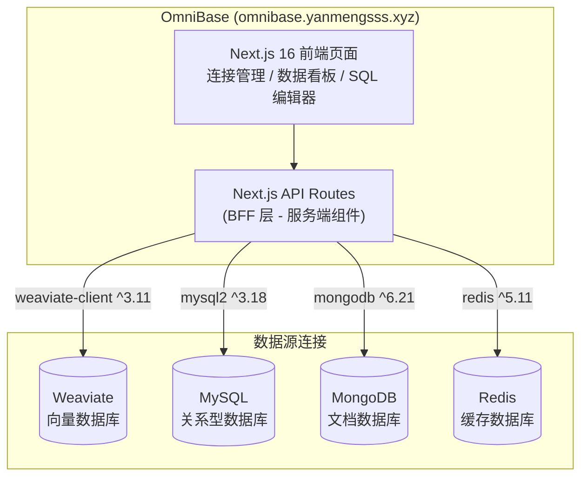
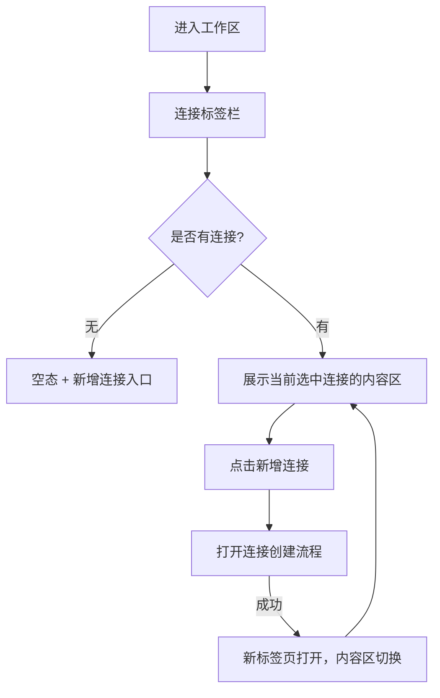
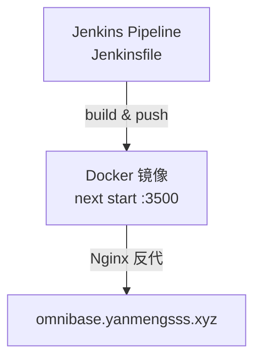

# OmniBase — 数据库观测汇总平台架构说明


> **生产域名**：`https://omnibase.yanmengsss.xyz/`  
> **技术栈**：Next.js 16 · React 19 · weaviate-client · mysql2 · redis · mongodb · shadcn/ui  
> **部署方式**：Jenkins + Docker (`next start`)

---

## 一、项目定位

OmniBase 是一个**多数据源可视化管理平台**（Data Manager），帮助开发者、数据科学家和 DBA 在统一的 GUI 界面中连接并管理多种异构数据源，无需在多个工具间切换。

支持的数据源：
- 🔷 **Weaviate**（向量数据库）：Class 与对象 CRUD
- 🐬 **MySQL**：库/表/行管理 + SQL 编辑器
- 🍃 **MongoDB**：数据库/集合/文档管理
- 🔴 **Redis**：Key-Value 查看/编辑、TTL 管理

---

## 二、核心功能

| Epic | 功能描述 |
|------|---------|
| 多数据源连接管理 | 选择数据源类型 → 填写连接参数 → 测试连接 → 打开标签页会话 |
| Schema/结构管理 | Weaviate Class 管理、MongoDB 集合管理、MySQL 表结构查看、Redis Keyspace 概览 |
| 数据对象 CRUD | 分页查看/新增/编辑/删除（均有危险操作二次确认） |
| 标签页与会话管理 | 多会话并行、标签切换、同类型多实例独立上下文 |
| SQL 编辑器 | MySQL 专属，支持 SELECT/DDL/DML，危险操作高亮提示 |

---

## 三、系统架构

OmniBase 为**纯前端直连**架构，Next.js 通过 API Routes（BFF 层）直接与各数据库 SDK 通信，无需额外后端服务：



---

## 四、页面路由设计

| 路由 | 功能 |
|------|------|
| `/` | 首页 / 项目工作区（连接标签栏） |
| `/connect` | 新建连接（选择数据源类型 + 填写参数） |
| `/dashboard/[connId]` | 某连接的数据管理面板 |
| `/dashboard/[connId]/weaviate` | Weaviate Class 与对象管理 |
| `/dashboard/[connId]/mysql` | MySQL 表管理 + SQL 编辑器 |
| `/dashboard/[connId]/mongodb` | MongoDB 文档管理 |
| `/dashboard/[connId]/redis` | Redis Key 管理 |

---

## 五、多标签页会话管理



**设计原则：**
- 每个连接在顶部打开独立标签页
- 多个相同类型数据源（如 MySQL:prod + MySQL:analytics）上下文完全隔离
- 标签可自定义别名与颜色标识
- 关闭标签只释放对应会话连接

---

## 六、数据操作安全规范

| 操作类型 | 保护措施 |
|---------|---------|
| 删除集合/Class | 二次确认弹窗 |
| `DROP`/`TRUNCATE` SQL | 高亮警告 + 二次确认 |
| `DELETE` 无 WHERE | 拦截提示 + 确认 |
| Redis 批量删除 | 二次确认 |
| 凭证安全 | 仅用于会话连接，掩码显示，不写日志 |

---

## 七、技术栈详情

| 分层 | 技术 | 版本 |
|------|------|------|
| 框架 | Next.js | 16.1.6 |
| UI | shadcn/ui, Radix UI, TailwindCSS | latest |
| Weaviate SDK | weaviate-client | ^3.11.0 |
| MySQL | mysql2 | ^3.18.0 |
| MongoDB | mongodb | ^6.21.0 |
| Redis | redis | ^5.11.0 |
| 表单 | react-hook-form, zod | latest |

---

## 八、部署信息

| 项目 | 命令 | 端口 | 域名 |
|------|------|------|------|
| OmniBase | `next build && next start` | 3500 | `omnibase.yanmengsss.xyz` |



- **CI/CD**：Jenkins Pipeline（`Jenkinsfile` 已在项目根目录）
- **容器**：Docker（`Dockerfile` 已在项目根目录）
- **连接信息安全**：用户输入的数据库凭证存储于会话状态中，不持久化到服务器

---

## 九、与其他项目的关系

OmniBase 与其他模块**完全独立**，不共享任何代码或数据：

```
OmniBase (omnibase.yanmengsss.xyz)
  └── 直连数据库（Weaviate / MySQL / MongoDB / Redis）
      └── 这些数据库同时也被 LifePilot 等项目使用
          └── 但 OmniBase 仅作只读/管理用途，不影响业务逻辑
```
