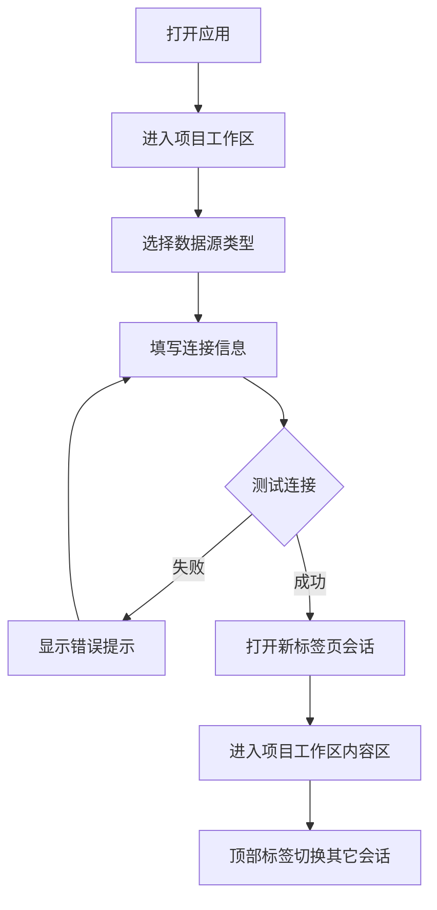
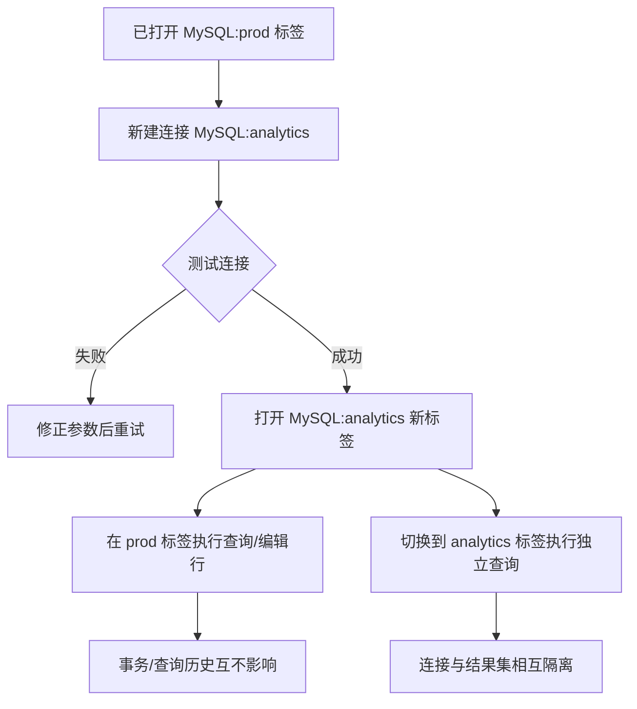
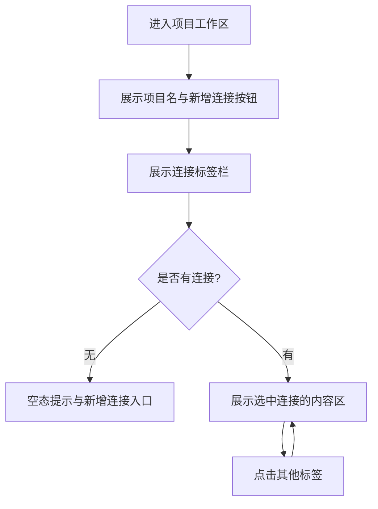

# Data Manager - 通用数据助手产品需求文档 (PRD)

## 1. Requirement Analysis & Understanding (需求分析)

### 1.1 背景与目标
团队最初聚焦 Weaviate 的可视化管理，但实际使用中，开发者与数据科学家往往需要在多个异构数据源之间切换（如 Redis、MongoDB、MySQL、Weaviate）。为降低操作门槛、提升多源数据的运维与开发效率，我们将产品升级为“通用数据助手”（Data Manager）：统一的可视化控制台，支持连接并管理多种数据源，提供 GUI 与直接命令（如 SQL）两种操作形态。

### 1.2 目标用户 (Target Audience)
- **后端开发者 / AI 开发者**：在多个数据源间进行调试、验证、联调。
- **数据科学家**：直观进行数据增删改查、Schema/结构管理与快速探索。
- **数据库管理员 (DBA)**：日常数据库/缓存运维、状态巡检、问题排查。

### 1.3 核心价值与痛点 (Core Value / Problem)
- **痛点**：缺乏统一、轻量的 GUI 来管理多种数据源；不同工具切换成本高；既需要可视化操作，也希望保留直接执行命令（如 SQL）的灵活性。
- **核心价值**：提供“即连即用”的统一面板，支持 Redis / MongoDB / MySQL / Weaviate 的连接与并行管理；统一的 CRUD 体验；提供标签页式会话管理与命令执行能力。

### 1.4 关键场景 (Key Scenarios)
- 用户选择数据源类型（Redis / MongoDB / MySQL / Weaviate），输入对应连接信息（如 Host、Port、用户名/密码或 API Key/OIDC）进行连接。
- 连接成功后，打开一个新的“标签页”会话，展示该数据源的资源结构（如数据库/集合/表、Class 列表、Redis Keyspace）。
- 在某个资源下进行 CRUD：
  - Weaviate：Class 与对象管理。
  - MongoDB：库/集合/文档管理。
  - MySQL：库/表/行管理；可在 SQL 编辑器直接执行查询/DDL/DML。
  - Redis：Key 的查看、编辑与删除（支持常见类型及 TTL）。
- 进入项目工作区后，顶部展示项目名与“新增连接”，中间为连接标签栏，底部为内容区。
- 可同时打开多个标签页（多连接/多资源），在标签栏切换；内容区随选中标签更新。
- 支持同类型多连接并行（如多个 MySQL 或多个 Redis 实例），每个以独立面板呈现；会话上下文（凭证、连接、查询历史、事务/管道状态）相互隔离；标签可自定义别名与颜色标识。

---

## 2. Requirement Organization (需求梳理)

我们将需求划分为以下核心 Epic（史诗）：

### Epic 1: 多数据源连接管理 (Connection Management)
- **Story 1.1：选择数据源与连接**
  - 作为用户，我可以选择 Redis / MongoDB / MySQL / Weaviate，并填写对应连接参数进行连接。
  - *验收标准*：支持鉴权（密码/API Key/OIDC/证书可选）；连接失败给出明确的错误提示；成功连接后在顶部打开新的会话标签页并进入主面板。
- **Story 1.2：连接历史与快速重连（可选）**
  - 作为用户，我希望系统记住最近连接过的实例（脱敏展示），下次可一键重连。
- **Story 1.3：安全与密钥保护**
  - *验收标准*：凭证仅用于会话连接，不在日志中打印；敏感信息掩码显示；支持本地安全存储（可选）。

### Epic 2: 结构/Schema 管理 (Schema Management)
- **Story 2.1：Weaviate Class 管理**
  - *验收标准*：Class 列表与对象数量概览；新建/删除 Class（删除需二次确认）；配置 Vectorizer 等参数。
- **Story 2.2：MongoDB 数据库/集合管理**
  - *验收标准*：列出数据库与集合；新建/删除集合（删除需二次确认）；显示/编辑集合索引（可选）。
- **Story 2.3：MySQL 数据库/表管理**
  - *验收标准*：列出数据库/表；新建/删除表（可选，高危需二次确认）；查看表结构与索引。
- **Story 2.4：Redis Keyspace 概览**
  - *验收标准*：扫描/过滤 Key；显示类型与 TTL；提供常用 Key 操作入口（新增/删除）。

### Epic 3: 数据对象管理可视 CRUD (Data Management)
- **Story 3.1：Weaviate 对象列表与详情**
  - *验收标准*：分页/Limit；查看对象属性与向量信息（如可用）；新增/编辑/删除对象（删除需二次确认）。
- **Story 3.2：MongoDB 文档管理**
  - *验收标准*：分页/Limit；JSON 视图与编辑器；插入/更新/删除文档（删除需二次确认）；可基于简单筛选器查询。
- **Story 3.3：MySQL 行管理 + SQL 编辑器**
  - *验收标准*：分页/Limit 行查看；表单式新增/编辑/删除行（删除需二次确认）；提供 SQL 编辑器支持 SELECT/DDL/DML，显示结果表格与影响行数；危险操作（DROP/TRUNCATE/DELETE 无 WHERE）需高亮提示并二次确认。
- **Story 3.4：Redis Key 管理**
  - *验收标准*：支持 String/Hash/List/Set/ZSet 基本操作；新建/查看/编辑/删除；设置/查看 TTL；批量删除需二次确认。

### Epic 4: 标签页与会话管理 (Tabs & Sessions)
- **Story 4.1：多会话标签页**
  - *验收标准*：每个连接或资源视图在顶部打开为一个标签页；支持关闭、切换、重命名（可选）。
- **Story 4.2：标签页状态与恢复（可选）**
  - *验收标准*：应用重启后可恢复上次会话（敏感信息需重新验证）。
- **Story 4.3：同类型多实例独立面板**
  - *验收标准*：允许同时打开多个相同类型的数据源连接（如 MySQL:prod 与 MySQL:analytics）；每个标签页拥有独立连接池/上下文与查询历史；关闭标签仅释放对应会话；支持标签别名与颜色区分，同名主机可通过别名避免混淆；标签可拖拽排序（可选）。

### Epic 5: 监控与状态（可选）
- **Story 5.1：基础状态面板**
  - *验收标准*：显示连接状态、版本信息、基础统计（如集合/表数量、Key 数量、对象数量）。

---

## 3. Interaction Flow Design (交互流程设计)

以下是用户核心操作路径的交互流程。

### 3.1 连接与标签页总体流程 (Core Happy Path)



### 3.2 典型操作流程（按数据源）

```mermaid
graph TD
  A[Weaviate 标签页] --> W1[选择 Class]
  W1 --> W2[查看对象列表 (分页)]
  W2 --> W3[新增/编辑/删除 对象]

  B[MongoDB 标签页] --> M1[选择 数据库/集合]
  M1 --> M2[查看文档列表 (分页/过滤)]
  M2 --> M3[插入/更新/删除 文档]

  C[MySQL 标签页] --> S1[选择 数据库/表]
  S1 --> S2[查看行 (分页)]
  S2 --> S3[新增/编辑/删除 行]
  C --> S4[SQL 编辑器 执行查询/DDL/DML]

  D[Redis 标签页] --> R1[扫描/过滤 Keys]
  R1 --> R2[查看/编辑 Key 值/TTL]
  R2 --> R3[删除/批量删除（确认）]
```

### 3.3 同类型多实例标签页流程



### 3.4 项目工作区页面流程



---

## 4. Prototype Wireframes (原型图/线框图)

### 4.1 登录/连接页面

```text
+---------------------------------------------------------+
|                                                         |
|                    [Data Manager Logo]                  |
|                                                         |
|  Type       | [ Redis ▼ ] [ MongoDB ] [ MySQL ] [ Weaviate ] |
|                                                         |
|             +-------------------------------+           |
|  Host       | 127.0.0.1                      |           |
|             +-------------------------------+           |
|             +---------------+    +--------------------+ |
|  Port       |     6379      |    |  Auth / API Key    | |
|             +---------------+    +--------------------+ |
|                                                         |
|  Advanced   [ ] SSL/TLS   [ ] 使用 OIDC (Weaviate)       |
|                                                         |
|                    [   Connect   ] [   Test   ]         |
|                                                         |
+---------------------------------------------------------+
```

### 4.2 项目工作区（连接标签与内容区）

```text
+----------------------------------------------------------------------------------+
| 项目名                                                             [新增连接] |
|----------------------------------------------------------------------------------|
| [数据库1] [数据库2] [数据库3]                                                     |
|----------------------------------------------------------------------------------|
|                                                                                  |
|                                数据库内容                                        |
|                                                                                  |
|                                                                                  |
|                                                                                  |
+----------------------------------------------------------------------------------+
```

## 5. 页面模块说明（项目工作区）

- **顶部项目区**：展示项目名与“新增连接”按钮，按钮点击进入连接创建流程。
- **连接标签栏**：展示已连接的数据源标签，支持点击切换；选中态清晰可识别。
- **内容区**：展示当前选中连接的资源结构与数据内容，随标签切换实时更新。
- **空态**：无任何连接时展示空态提示与新增连接入口。
- **加载态**：连接建立中展示加载反馈，禁止重复提交。
- **错误态**：连接失败时展示错误原因与重试入口。

## 6. 非功能需求与衡量指标

### 6.1 非功能需求
- **性能**：项目工作区首次加载无明显卡顿；标签切换无明显延迟。
- **安全**：凭证仅用于会话连接；敏感信息掩码展示；不写入日志。
- **可用性**：错误提示可理解且可恢复；危险操作保持二次确认。

### 6.2 关键指标
- **连接成功率**：成功连接数 / 发起连接数。
- **连接建立时长**：从提交连接到成功进入内容区的耗时。
- **标签活跃度**：人均同时打开连接数、日均标签切换次数。

## 7. Delivery Checklist (产品评审检查清单)

- [x] 目标用户是否定义清晰？（开发者/数据科学家/DBA，面向多数据源）
- [x] 主流程是否连贯？（从连接到 CRUD/命令执行与标签页切换）
- [x] 边缘场景是否涵盖？（连接失败、危险操作二次确认、空状态、安全与脱敏）
- [x] 原型图是否反映交互目标？（多数据源连接、标签页、SQL 编辑器与多面板）
- [x] 是否体现业务价值？（统一多源管理、降低工具切换成本、提升效率）
- [x] 危险操作控制？（DROP/TRUNCATE/批量删除等需高亮与二次确认）
- [x] 安全合规？（凭证不落盘/日志脱敏；可选安全存储与 OIDC 支持）
- [x] 同类型多连接并行？（支持多个 MySQL/Redis 实例，独立面板与上下文隔离）
